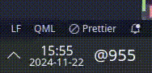

# zone.bears.plasma.beats

Missing a .Beats (Swatch Internet Time) widget for KDE plasma, I made one.

`git clone https://github.com/bearsdotzone/zone.bears.plasma.beats.git ~/.local/share/plasma/plasmoids/zone.bears.plasma.beats`

